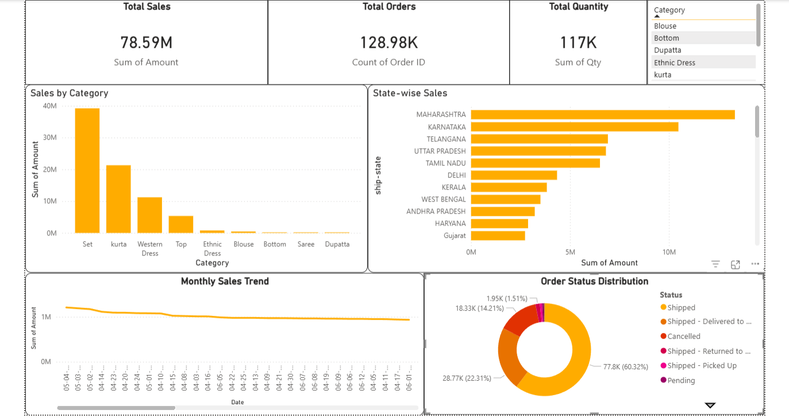
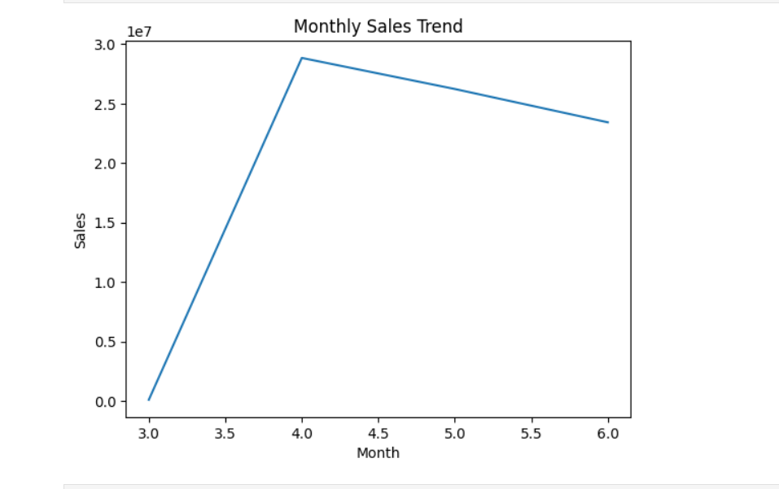
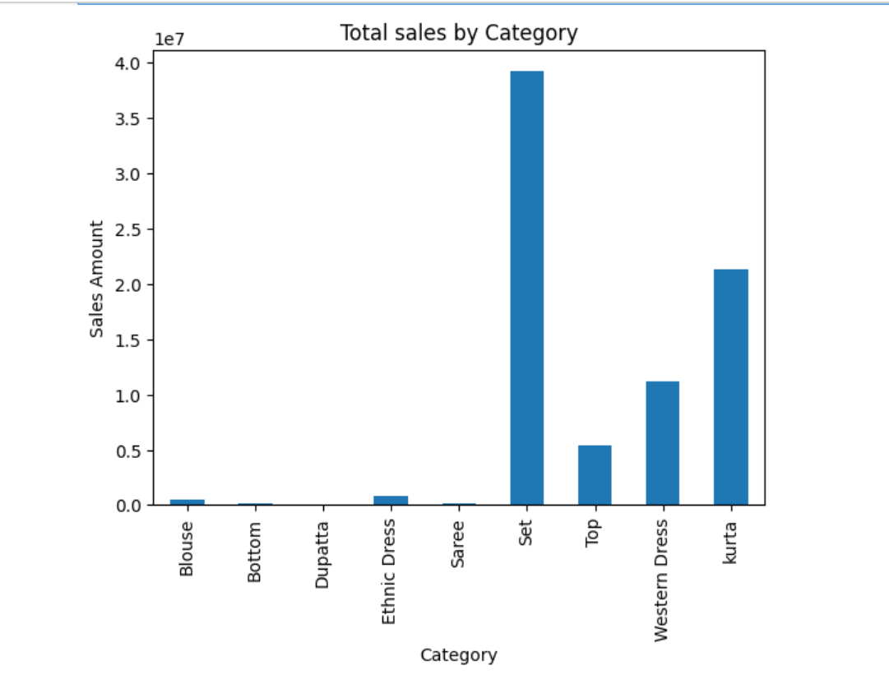
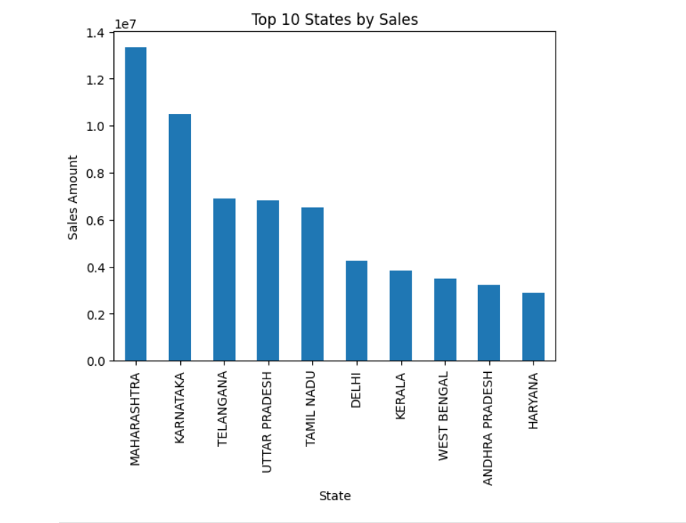

# Amazon Sales Analysis

## 📊 Dashboard Preview



---

## 📌 Project Overview

This project analyzes Amazon sales data using **Python, Pandas, Matplotlib, and Power BI** to uncover sales trends, category performance, and business insights. The objective was to transform raw sales data into meaningful visualizations and actionable insights that support data-driven decision-making.

---

## 🎯 Project Objectives

* Analyze Amazon sales performance
* Identify top-performing product categories
* Discover monthly sales trends
* Evaluate state-wise sales distribution
* Generate business insights through data visualization
* Build an interactive Power BI dashboard

---

## 🛠️ Tools & Technologies Used

* Python
* Pandas
* NumPy
* Matplotlib
* Jupyter Notebook
* Power BI
* Microsoft Excel

---

## 📂 Project Structure

```text
amazon-sales-analysis/
│
├── dashboard/
│   └── amazon_sales_dashboard.pbix
│
├── data/
│   └── Amazon Sale Report.csv
│
├── images/
│   ├── dashboard_preview.png
│   ├── monthly_sales_by_category.png
│   ├── monthly_sales_trend.png
│   └── state_sales_analysis.png
│
├── notebooks/
│   └── amazon_sales_analysis.ipynb
│
└── README.md
```

## 🔍 Key Analysis Performed

✔ Data Cleaning and Preprocessing

✔ Exploratory Data Analysis (EDA)

✔ Monthly Sales Trend Analysis

✔ Product Category Performance Analysis

✔ State-wise Sales Analysis

✔ Data Visualization and Reporting

✔ Interactive Dashboard Development

---

## 📈 Key Insights

* Top-performing states contributed significantly to overall revenue.
* Certain product categories consistently generated higher sales.
* Monthly sales trends revealed peak sales periods.
* Visual analysis helped identify business growth opportunities.
* Dashboard reporting improved accessibility of business insights.

---

## 📷 Visualizations

### Monthly Sales Trend



### Sales by Category



### State-wise Sales Analysis



---

## 📊 Power BI Dashboard

An interactive Power BI dashboard was created to visualize:

* Sales Trends
* Category Performance
* State-wise Sales
* Business KPIs
* Revenue Insights

---

## 🚀 Skills Demonstrated

* Data Cleaning
* Data Analysis
* Data Visualization
* Business Intelligence
* Dashboard Development
* Problem Solving
* Data Storytelling

---

## 👨‍💻 Author

**Pranav Aseri**

Aspiring Data Analyst passionate about transforming data into meaningful insights through analytics and visualization.
